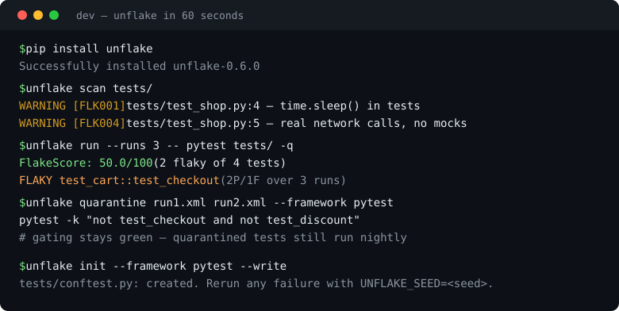
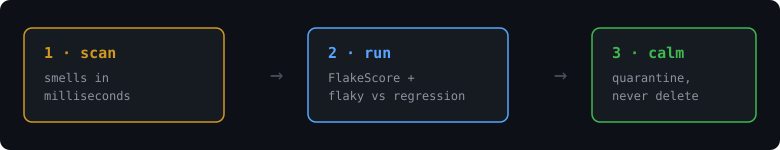

# Unflake 🟢

[](https://github.com/robinaider/unflake/actions/workflows/ci.yml)
[](https://scorecard.dev/viewer/?uri=github.com/robinaider/unflake)
[](https://pypi.org/project/unflake/)
[](LICENSE)

**Green CI without the "just rerun it" ritual.**



CI is red. You rerun. It's green. You merge, trusting nothing. Unflake hunts the flake instead: static scan in milliseconds, FlakeScore across repeated runs, regression-vs-flake verdicts, and quarantine configs that keep the build green *without deleting a single test*.



```bash
pip install unflake
unflake scan tests/                                  # 1. smells, instantly
unflake run --runs 3 --runner pytest -- pytest tests/ -q   # 2. collect + score
unflake quarantine run1.xml run2.xml --framework pytest    # 3. quarantine, don't delete
unflake init --framework pytest --write              # 4. seeded RNG scaffold (prevention)
```

JS-first repo? Same tool, no Python packaging — just Python itself (3.9+):

```bash
npx unflake-ci scan tests/
npx unflake-ci run --runs 3 --runner vitest -- npx vitest run tests/
```

Proven on real suites: 3,676 tests × 5 runs across attrs/click/tqdm → FlakeScore 100,
0 false quarantines ([study](benchmarks/BENCH.md)).

No install handy? `bash demo.sh` runs the whole loop on fixtures in 60 seconds.

> ⭐ If flaky tests have ever paged you, star this — it helps other devs find it.

## Before / after

```python
# before: the 3am pager
def test_checkout():
    time.sleep(5)                       # pray the server is up
    assert requests.get(API).ok         # real network in a unit test
```

```bash
$ unflake scan tests/
  WARNING [FLK001] tests/test_shop.py:4 — time.sleep() in tests makes timing-dependent flakes
           fix: Replace with polling (wait_for / waitFor / eventually) with a timeout, or freeze time.
  WARNING [FLK004] tests/test_shop.py:5 — Real network calls in tests fail without mocks ...
```

```bash
$ unflake run --runs 3 -- pytest tests/ -q
FlakeScore: 50.0/100 (2 flaky of 4 tests)
  FLAKY test_cart::test_checkout (2P/1F over 3 runs)
  FLAKY test_cart::test_discount (2P/1F over 3 runs)
```

```bash
$ unflake quarantine run1.xml run2.xml --framework pytest
pytest -k "not test_checkout and not test_discount"   # gating run stays green
pytest -k "test_checkout or test_discount"            # nightly run still reports
```

Quarantine preserves signal; deletion hides it. Every quarantined test still runs — it just can't fail the build. **Regressions are never quarantined**: green-then-red-forever is a real failure — fix it.

## Flaky or regression? Unflake knows the difference

Pass result files oldest → newest and Unflake separates three fates:

| Verdict | Meaning | Action |
|---|---|---|
| `FLAKY` | mixed outcomes, no clean break | quarantine + fix root cause |
| `REGRESSION` | green until run N, red ever since | fix now — never quarantine |
| `NEW` / stable | seen once / always green / always red | more runs / ship it / real bug |

Two runs can only suggest a flake; calling a regression needs ≥3. One run proves nothing — `unflake run` exists so there's no excuse.

## Why not the others?

| | Unflake | Heavy flake platforms |
|---|---|---|
| Install | zero-dep, stdlib only, `pip install unflake` | OTel collectors, dashboards, SaaS |
| Input | JUnit XML from **any** framework (pytest ✅, Vitest ✅, Playwright ✅, Jest ✅ e2e — plus generic `--junit-flag`, Go, JUnit…) | per-framework reporters/plugins |
| First value | `scan` in milliseconds, no execution | needs history ingestion |
| Verdicts | flaky vs regression vs new, change-point included | usually just a score |
| Philosophy | quarantine, never delete | often auto-skip-and-forget |
| Agent-native | `SKILL.md` + harness adapters day one | docs page, if you're lucky |

## Works with your harness

Claude Code · Codex · Copilot · Cursor · Gemini · Pi · OpenCode · Windsurf · Cline · Qoder — plus a GitHub Action (`action.yml`, SARIF → code scanning) and a pre-commit hook. Details: [`docs/ADAPTERS.md`](docs/ADAPTERS.md). The skill lives at [`skills/unflake/SKILL.md`](skills/unflake/SKILL.md).

10 rules today, incl. the JS classics: `cy.wait(ms)` (FLK009) and `waitForTimeout` (FLK010).
Precision features: localhost-aware severities, string-literal awareness (Python),
`--exclude` globs, and SARIF rule metadata for code scanning.

## Benchmarks (honest, reproducible)

Fixtures + real pytest e2e + a real-repo scan (`psf/requests`: 120 findings in ~0.1s — with the noise documented, not hidden). Method, numbers, and known limitations: [`benchmarks/BENCH.md`](benchmarks/BENCH.md). If a number doesn't reproduce, that's a bug — file it.

## Contributing — built for drive-by PRs

- 🧪 New FLK rule = one regex + one test (`good first issue`)
- 🔌 New harness adapter or quarantine emitter = one file + one test
- 🌱 `unflake init` for your framework = one snippet
- 🌍 Translations welcome (`README.<lang>.md`)
- Full loop: [`CONTRIBUTING.md`](CONTRIBUTING.md)

## Roadmap

- [x] v0.1 — scan / analyze / quarantine, SARIF, 4 frameworks, skill + adapters
- [x] v0.2 — `run` collector, regression-vs-flake verdicts, `init` scaffolder, FLK009/FLK010, pre-commit + GitHub Action, `pip install unflake`
- [x] v0.3 — `--runner` presets, per-run logs, real-pytest e2e in CI, launch kit (`demo.sh`, templates, `LAUNCH.md`), real-repo validation
- [x] v0.4 — precision (localhost-aware FLK004, literal-awareness), `--exclude`, SARIF rules, safe `-k` quoting, CI matrix 3.10–3.14
- [x] v0.5 — `unflake-ci` npx wrapper (verified pack→install→run), `--runner vitest` verified e2e
- [x] v0.6 — `--runner` playwright + jest verified e2e, real-repo study (3,676 tests, 0 false quarantines)
- [ ] Recall study v2 on suites with known flakes (specificity proven; recall needs wild flakes)
- [ ] JS/TS string-literal awareness + variable-host local-server detection (see BENCH.md)

## License

MIT — see [LICENSE](LICENSE).
